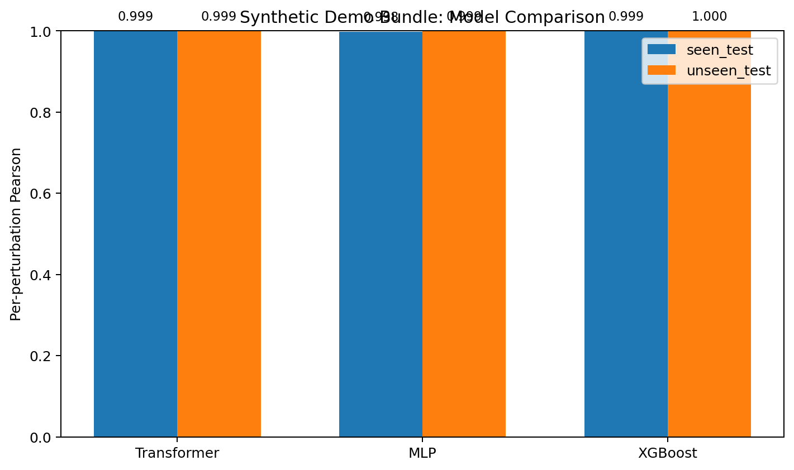
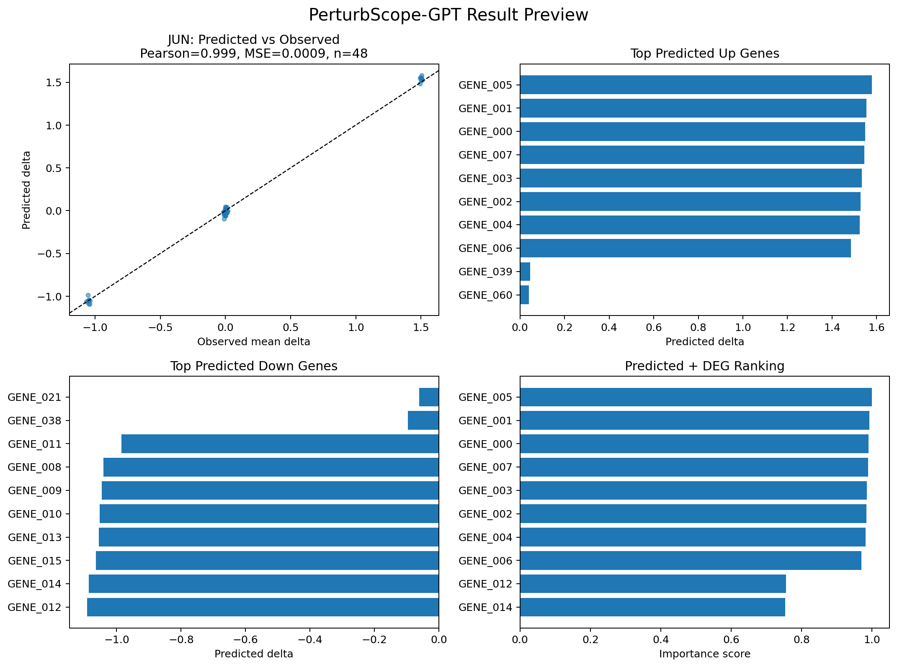
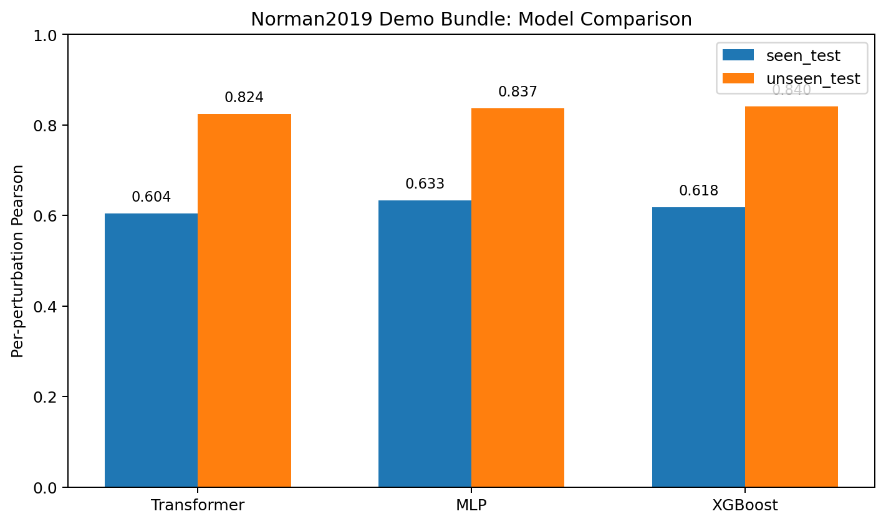
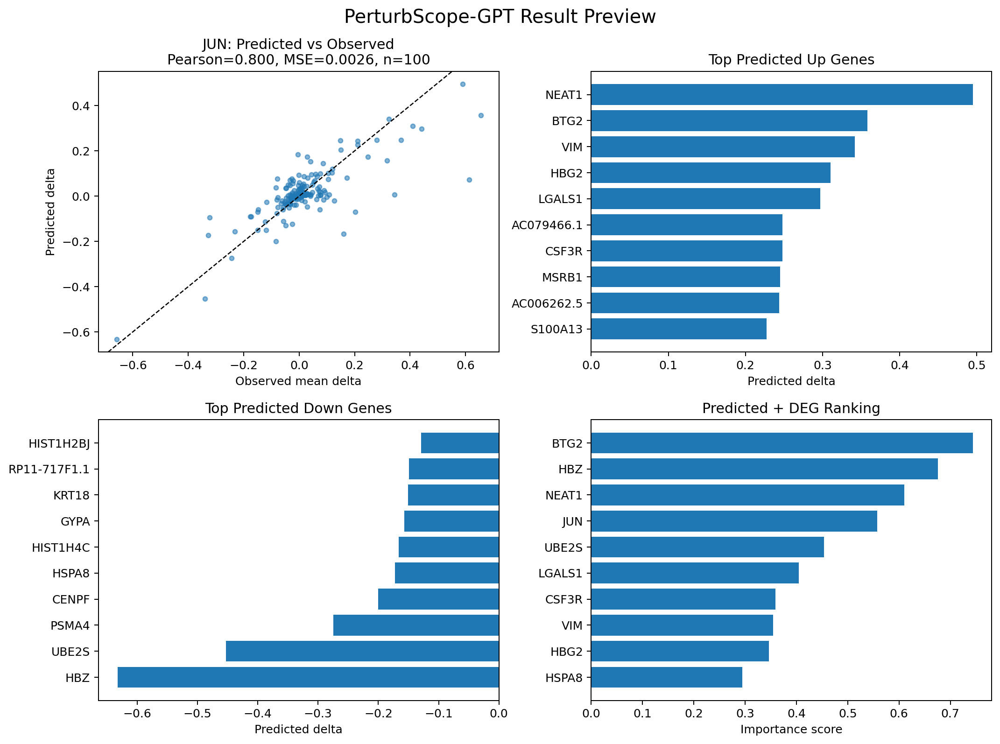

# PerturbScope-GPT

> Local-first Transformer for single-cell perturbation response prediction,
> trained on Norman2019 (K562 · 10,500 cells · 512 HVGs · 105 single-gene conditions).

**Tech stack:** Python 3.11 · PyTorch · scanpy · scikit-learn · XGBoost · Streamlit · uv

[](https://github.com/musuntana/scgpt/actions/workflows/ci.yml)

## Key Results (Norman2019, real data)

| Model | Unseen Pearson | Unseen MSE | Top-100 DEG Overlap |
| --- | ---: | ---: | ---: |
| Transformer | 0.824 | 0.0011 | **0.976** |
| MLP | 0.837 | 0.00085 | — |
| XGBoost | 0.840 | 0.00084 | — |

All three models generalize to **unseen perturbations** with Pearson ≥ 0.82.
The Transformer's top-100 DEG overlap of **0.976** confirms that predicted
expression shifts identify the correct differentially expressed genes at high recall.

See [Real Norman2019 results](#real-norman2019-results) for per-split tables and figures.

## Quick Start

No dataset download required to try the offline demo:

```bash
# 1. Set up environment
./scripts/bootstrap_env.sh && source .venv/bin/activate

# 2. Generate offline synthetic showcase (trains all three models)
./scripts/run_generate_synthetic_showcase.sh

# 3. Launch Streamlit app
./scripts/run_app.sh
```

For the full Norman2019 real-data flow, see [Real Norman2019 workflow](#real-norman2019-workflow) below.

## Project Goal

Build a job-ready MVP that can:
- preprocess public Perturb-seq data into a reproducible training set
- predict perturbation-induced expression changes with a Transformer
- compare against MLP and XGBoost baselines
- produce DEG-based target rankings
- expose inference results in a Streamlit demo

See [`docs/architecture.md`](docs/architecture.md) for model and data-flow details.

## Local-First MVP Scope

- dataset: `scPerturb / Norman2019`
- sample scope: single-gene perturbations only
- target: `delta expression`
- primary metric: `per-perturbation Pearson`
- default HVG count: `512`

## Environment

This repository now uses `uv` as the default environment and dependency manager.

- Python version: `3.11`
- local virtual environment: `.venv`
- local uv cache: `.uv-cache`
- dependency source of truth: [`pyproject.toml`](pyproject.toml)
- locked dependency snapshot: [`uv.lock`](uv.lock)

### Bootstrap

Create the local development environment:

```bash
./scripts/bootstrap_env.sh
```

This will:
- create `.venv` in the current repository
- install Python `3.11` if `uv` needs to fetch it
- sync runtime and dev dependencies with `uv`

### Activate

```bash
source .venv/bin/activate
```

You can also avoid manual activation and run everything through `uv run` or the shell wrappers in `scripts/`.

## Main Commands

Run tests:

```bash
./scripts/run_tests.sh
# or
make test
```

Run linting and type checking:

```bash
make lint        # ruff check --fix
make typecheck   # mypy src/
```

Install pre-commit hooks (runs ruff automatically before each commit):

```bash
source .venv/bin/activate
pre-commit install
```

Start the Streamlit app:

```bash
./scripts/run_app.sh
```

The app prefers the real local demo artifacts when they exist:
- bundle: `data/processed/norman2019_demo_bundle`
- artifact dir: `artifacts/transformer_seen_norman2019_demo`
- checkpoint: `<artifact dir>/best_model.pt`

Offline fallback when raw data download is unavailable:

```bash
./scripts/run_generate_synthetic_demo.sh
```

This generates a clearly labeled synthetic bundle and demo artifacts:
- bundle: `data/processed/synthetic_demo_bundle`
- artifact dir: `artifacts/transformer_seen_synthetic_demo`
- files: `best_model.pt`, `seen_test_metrics.json`, `unseen_test_metrics.json`, `deg_artifact.csv`, `run_summary.json`

When the real Norman2019 demo artifacts are absent but the synthetic ones exist, the Streamlit app will default to the synthetic paths automatically.

Generate the full offline showcase, including baselines and result figures:

```bash
./scripts/run_generate_synthetic_showcase.sh
```

This also produces:
- `artifacts/mlp_seen_synthetic_demo/`
- `artifacts/xgboost_seen_synthetic_demo/`
- `docs/assets/model_comparison_seen_synthetic_demo.png`
- `docs/assets/transformer_inference_preview_synthetic_demo.png`

Current app behavior:
- load a saved torch checkpoint
- select a perturbation gene from the processed bundle
- run aggregated inference for that perturbation
- if `deg_artifact.csv` exists in the artifact directory, combine predicted delta with real DEG significance
- show predicted vs observed delta, top predicted genes, true DEG rows, target ranking, and top-k DEG overlap

Preprocess a dataset bundle:

```bash
./scripts/run_preprocess_demo.sh \
  --input-path data/raw/your_dataset.h5ad \
  --output-dir data/processed/demo_bundle
```

Download the default `Norman2019` dataset:

```bash
./scripts/download_norman2019.sh
```

If `curl` keeps resetting on your network, retry with the alternate backend:

```bash
./scripts/download_norman2019.sh --backend wget
```

If you downloaded the file manually, verify the checksum before continuing:

```bash
./scripts/download_norman2019.sh --verify-only
```

Inspect AnnData schema and auto-resolved columns:

```bash
./scripts/run_inspect_anndata.sh \
  --input-path data/raw/NormanWeissman2019_filtered.h5ad \
  --output-json data/interim/norman2019_schema.json
```

Run the full Norman2019 local demo flow:

```bash
./scripts/run_norman2019_demo.sh
```

Train the Transformer:

```bash
./scripts/run_train_transformer.sh \
  --bundle-dir data/processed/demo_bundle \
  --output-dir artifacts/transformer_seen
```

Train baselines:

```bash
./scripts/run_train_baselines.sh \
  --bundle-dir data/processed/demo_bundle \
  --output-dir artifacts/baselines \
  --baseline mlp
```

The baseline output directory stores split-specific metrics:
- `mlp_seen_test_metrics.json` and `mlp_unseen_test_metrics.json`
- `xgboost_seen_test_metrics.json` and `xgboost_unseen_test_metrics.json`
- `xgboost_model.joblib` and `xgboost_run_summary.json` for the tree baseline

Generate a real DEG artifact for app ranking:

```bash
./scripts/run_generate_deg_artifact.sh \
  --input-path data/raw/NormanWeissman2019_filtered.h5ad \
  --bundle-dir data/processed/norman2019_demo_bundle \
  --output-dir artifacts/transformer_seen_norman2019_demo
```

Evaluate a saved model:

```bash
./scripts/run_evaluate.sh \
  --bundle-dir data/processed/demo_bundle \
  --checkpoint-path artifacts/transformer_seen/best_model.pt \
  --model-type transformer \
  --output-path artifacts/transformer_seen/test_metrics.json \
  --deg-artifact-path artifacts/transformer_seen/deg_artifact.csv
```

When `--deg-artifact-path` is provided, the evaluation also computes top-k DEG overlap metrics.

Evaluate all three models in one command:

```bash
./scripts/run_full_evaluation.sh
# or
make eval
```

This evaluates Transformer and MLP on both seen and unseen test splits. XGBoost metrics are already written at train time.

Write a structured local run summary:

```bash
./scripts/run_summarize_run.sh \
  --bundle-dir data/processed/demo_bundle \
  --output-dir artifacts/transformer_seen \
  --checkpoint-path artifacts/transformer_seen/best_model.pt \
  --model-type transformer \
  --split-prefix seen \
  --seen-metrics-path artifacts/transformer_seen/seen_test_metrics.json \
  --unseen-metrics-path artifacts/transformer_seen/unseen_test_metrics.json
```

## Results
### Included offline showcase assets

The repository includes committed synthetic showcase figures that can be regenerated with:

```bash
./scripts/run_generate_synthetic_showcase.sh
```

Use this offline showcase for:
- local product and UI demos
- interview-time walkthroughs of the training/evaluation pipeline
- repository validation when the real dataset is not available yet

Do **not** present these synthetic metrics as real biological results.

### Synthetic model comparison



| Model | Seen Test Pearson | Seen Test MSE | Unseen Test Pearson | Unseen Test MSE |
| --- | ---: | ---: | ---: | ---: |
| Transformer | 0.9988 | 0.0040 | 0.9989 | 0.0040 |
| MLP | 0.9984 | 0.0047 | 0.9995 | 0.0036 |
| XGBoost | 0.9992 | 0.0046 | 0.9999 | 0.0014 |

Interpretation:
- the offline showcase verifies that preprocessing artifacts, model training, evaluation, ranking, and visualization all run locally
- all models perform strongly on the synthetic task because the signal is intentionally structured and low-noise
- this section is useful for engineering demonstration, not for claiming real perturbation biology performance

### Synthetic Streamlit preview



The preview above is generated from the same synthetic checkpoint and bundle that the app can fall back to automatically.

Launch the interactive app locally with:

```bash
./scripts/run_app.sh
```

Regenerate the README result assets with:

```bash
./scripts/run_generate_results_assets.sh
```

For the offline synthetic showcase:

```bash
./scripts/run_generate_synthetic_showcase.sh
```

### Real Norman2019 results

The figures below are generated from the real Norman2019 dataset
(`scPerturb / Norman2019`, K562, single-gene perturbations, 10,500 cells, 512 HVGs, 105 conditions).



| Model | Seen Test Pearson | Seen Test MSE | Unseen Test Pearson | Unseen Test MSE |
| --- | ---: | ---: | ---: | ---: |
| Transformer | 0.604 | 0.0071 | 0.824 | 0.0011 |
| MLP | 0.633 | 0.0066 | 0.837 | 0.00085 |
| XGBoost | 0.618 | 0.0066 | 0.840 | 0.00084 |

Transformer top-k DEG overlap (seen_test / unseen_test):
- top-20: 0.816 / 0.930
- top-50: 0.914 / 0.953
- top-100: 0.964 / 0.976



All three models achieve **Pearson ≥ 0.82** on unseen perturbations, indicating strong generalization.
The Transformer top-100 DEG overlap of **0.96–0.98** confirms that predicted expression shifts
identify the correct differentially expressed genes at high recall.

Regenerate these figures after training with:

```bash
./scripts/run_generate_results_assets.sh
```

### Real Norman2019 workflow

Real Norman2019 raw data and generated artifact directories are intentionally not committed by default.
Once `data/raw/NormanWeissman2019_filtered.h5ad` is present and verified, the supported local flow is:

```bash
./scripts/run_norman2019_demo.sh
./scripts/run_train_transformer.sh \
  --bundle-dir data/processed/norman2019_demo_bundle \
  --output-dir artifacts/transformer_seen_norman2019_demo
./scripts/run_train_baselines.sh \
  --bundle-dir data/processed/norman2019_demo_bundle \
  --output-dir artifacts/mlp_seen_norman2019_demo \
  --baseline mlp
./scripts/run_train_baselines.sh \
  --bundle-dir data/processed/norman2019_demo_bundle \
  --output-dir artifacts/xgboost_seen_norman2019_demo \
  --baseline xgboost
```

After the real bundle exists, regenerate real-data figures with:

```bash
./scripts/run_generate_results_assets.sh
```

## Notebooks

The `notebooks/` directory contains two runnable Jupyter notebooks.
Launch them with:

```bash
source .venv/bin/activate
jupyter lab notebooks/
```

| Notebook | Description |
| --- | --- |
| [`01_data_exploration.ipynb`](notebooks/01_data_exploration.ipynb) | EDA of the Norman2019 bundle: dataset overview, perturbation frequency, control-mean distributions, delta-expression histogram, per-perturbation heatmap |
| [`02_model_comparison.ipynb`](notebooks/02_model_comparison.ipynb) | Side-by-side metrics for Transformer, MLP, XGBoost; training curves; top-k DEG overlap bar charts; summary table |

Both notebooks load from `data/processed/norman2019_demo_bundle` and `artifacts/`.
Run `./scripts/run_norman2019_demo.sh` first to generate the required bundle.

## Repository Documents

- [`PROJECT_PLAN.md`](PROJECT_PLAN.md): development plan and architecture decisions
- [`AGENTS.md`](AGENTS.md): implementation constraints and anti-drift guardrails
- [`pyproject.toml`](pyproject.toml): uv project definition and dependency source of truth
- [`configs/data.yaml`](configs/data.yaml): data and preprocessing defaults
- [`configs/model.yaml`](configs/model.yaml): model and memory defaults
- [`configs/train.yaml`](configs/train.yaml): training, evaluation, and ranking defaults

## Recommended Workflow

1. bootstrap the environment with `./scripts/bootstrap_env.sh`
2. place a `.h5ad` file under `data/raw/`
3. optionally inspect schema resolution with `./scripts/run_inspect_anndata.sh`
4. preprocess it into a bundle under `data/processed/`
5. train a minimal Transformer on the seen split
6. evaluate seen and unseen metrics
7. write `run_summary.json` for the completed experiment
8. inspect ranking outputs or start Streamlit for demo artifacts

## Notes

- `requirements.txt` is kept as a compatibility fallback; update `pyproject.toml` first and refresh `uv.lock` with `uv sync`.
- the shell wrappers export `UV_PROJECT_ENVIRONMENT`, `UV_CACHE_DIR`, and `PYTHONPATH` so the project can be run consistently from the repo root
- if you change runtime dependencies, resync with `./scripts/bootstrap_env.sh`
- each meaningful local training run should keep `history.json`, `best_model.pt`, evaluation JSONs, and `run_summary.json` in the same artifact directory
